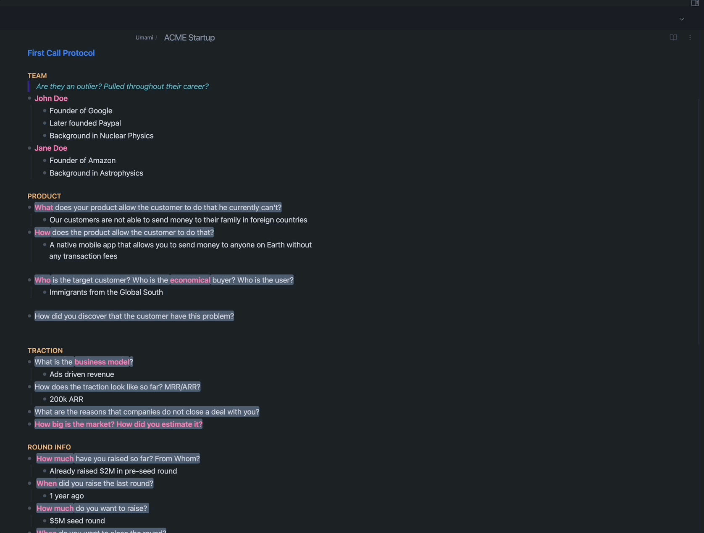
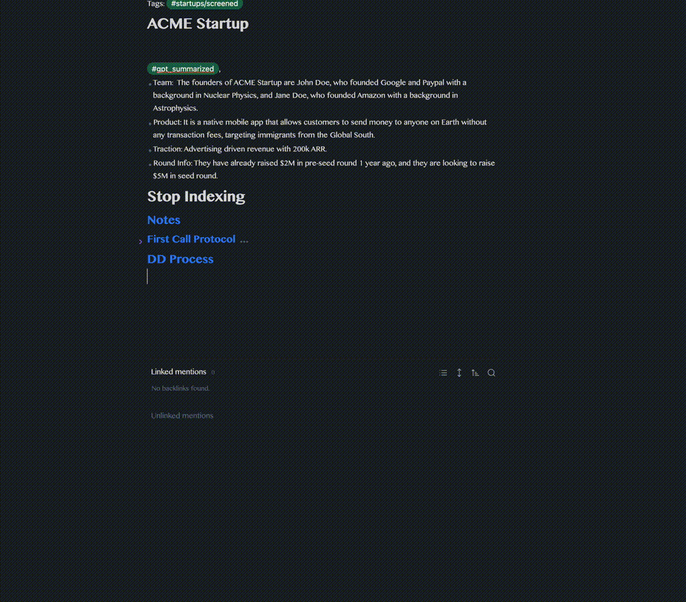

# Explanation

This plugin uses GPT-4 to support a venture capitalist (VC) with some of their daily tasks. This includes the following:

- Summarizing your notes after a call with a startup or another fund
- Pushing the information to your CRM (currently only supporting [Affinity](https://www.affinity.co/))
- Given a startup description, it generates the core problem the startup is trying to solve and hypotheses that needs to be validated for the startup to be successful.
- Given a startup description, it analyzes what could make the startup defensible based on some of the articles published by Elad Gil on the topic.

 Summarization and CRM syncing Demo 

## Summarization and Affinity Sync

 Startup DD

## Startup DD support

 Defensibility Analysis

## Startup DD support

# Setup Steps

- Clone this repo into `<obsidian-vault-path>/.obsidian/plugins/vc_copilot/`
- **OR** simply download the files `main.js`, `manifes.json`, and `styles.css`from the latest release into the folder `<obsidian-vault-path>/.obsidian/plugins/vc_copilot/`

## Settings

- The Affinity settings are only needed if you are using Affinity as CRM tool and would like to automatically push startups and VC connections there. If you are just using it for summarization and cleaning it from markdown syntax, just fill the other settings
- Add the investor names of your team members separated by commas, e.g: `Vinod Khosla, Elon Musk`, etc

# Usage

- After your are finished taking notes about a startup or a VC, add the correct hashtags to the note
  - For a VC -> #network/connected and type of VC ( #Person/VC or #Entity/VC )
  - For startup -> #startups/screened
- To summarize:

  - For a startup -> use the mouse to highlight the text you want to summarize -> `Cmd + P` -> summarize this startup
  - For a VC -> `Cmd + P` -> Summarize All VC Notes

- To push data to Affinity:

  - Check the #review and #review_startup hashtags
  - Approve that everything is fine or make your changes to the summary
  - Remove the #review (or #review_startup ) hashtag and add ( #Affinity ) instead
  - `Cmd + P` -> Push VCs or Startups to Affinity
  - Voila, data is pushed to Affinity ( the affinity hashtag will be removed automatically)

- To generate core problem and hypotheses to guide you with your DD:

  - `Cmd + P` -> Startup Guidance Workflow -> copy a description of the startup as detailed as possible

- To test the defensibility of a startup:

  - `Cmd + P` -> Evaluate Startup Defensibility -> copy a description of the startup as detailed as possible

- To use the `Find Investors for Startup` make sure that the VC connections you want to be considered do have `#network/connected` and `#Person/VC` in their notes. The note must be summarized with the "summarize VCs" functionality or you should have your note in the same format at least otherwise you won't get the best investors to share the startup with. To have a "focused search", the connections you want to include should have either `#network/strong`or `#testRelation` tags.

## External Tools and APIs Used

- [OpenAI](https://openai.com/); providing GPT-4
- [Affinity.co](https://www.affinity.co/); using their APIs to push data to their CRM
- [MeetingBaas](https://meetingbaas.com/); using their API to record meetings with meeting bots, and then fetch meeting data
